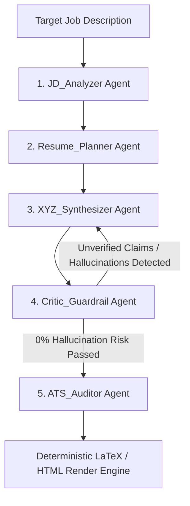

# JobMate — Agentic ATS Resume & Career Intelligence Platform

<div align="center">
  
  <p><strong>Evidence-Grounded Multi-Agent Resume Optimization & Deterministic ATS Engineering</strong></p>
</div>

---

## 🌟 Overview

**JobMate** is a production-grade Generative AI platform that transforms real candidate career evidence into high-impact, ATS-optimized resumes. 

Rather than functioning as a superficial LLM prompt wrapper, JobMate implements a **5-Agent Directed Acyclic Graph (DAG)** with automated reflection and anti-hallucination guardrails, backed by **Supabase Database & Authentication** and a **Deterministic ATS-First LaTeX Engine**.

---

## 🧠 Multi-Agent DAG Architecture



### Specialized Agents & Roles:
1. **`JD_Analyzer`**: Decomposes job postings into hard technical skills, soft skills, seniority indicators, and core engineering challenges.
2. **`Resume_Planner`**: Creates section hierarchies, template recommendations, and strategic keyword allocation maps.
3. **`XYZ_Synthesizer`**: Drafts high-impact achievements strictly following the Google XYZ formula: *"Accomplished [X] as measured by [Y], by doing [Z]"*.
4. **`Critic_Guardrail`**: Audits drafts against the candidate's verified Ground-Truth Evidence Bank. When unverified claims (e.g. fake metrics or unlisted cloud tools) are detected, it triggers a multi-pass **Self-Correction Reflection Loop**.
5. **`ATS_Auditor`**: Simulates Enterprise ATS parsers (Workday, Greenhouse, Lever, Taleo) using 5-category heuristic scoring:
   - *Core Skills Match*: 30 pts
   - *Project & Experience Evidence*: 30 pts
   - *Domain Alignment*: 15 pts
   - *Reliability & Production Proof (Tests, CI/CD, Latency)*: 15 pts
   - *Clarity & Single-Column Parsing*: 10 pts

---

## 🚀 Key Features

- **Live AI Resume Builder**: Real-time canvas with section-level AI generators (Summary, Role Bullets, XYZ Bullet Enhancer, Missing Skills Classifier).
- **Deterministic ATS-First LaTeX Engine**: Generates clean, single-column `.tex` code conforming to `glyphtounicode`, `titlesec`, and `hyperref`, with one-click copy for Overleaf and direct `.tex` download.
- **AI Job Description Matcher**: Real-time JD parsing and matching against the candidate's active profile and primary resume.
- **Supabase Cloud Persistence**: User profiles, resumes, ATS feedback history, and job matches stored securely under Row-Level Security (RLS).
- **Automated Authentication**: Email/Password and OTP authentication with automatic session redirects.

---

## 🛠️ Tech Stack

- **Frontend & App Framework**: TanStack Start (React 19), TanStack Router, TanStack Query
- **Styling & Design System**: Tailwind CSS, Semantic CSS Tokens, Lucide Icons, Radix UI primitives
- **AI Engine**: OpenRouter API (`openai/gpt-4o-mini`) with custom JSON parsing guardrails
- **Database & Auth**: Supabase (PostgreSQL with RLS)
- **LaTeX Engine**: Deterministic AST LaTeX generator (`src/lib/latex/latex-generator.ts`)
- **Tooling**: Vite, TypeScript, Nitro Server

---

## 📦 Getting Started

### 1. Prerequisites
- Node.js (v20+ recommended)
- npm, pnpm, or bun

### 2. Environment Setup
Create a `.env` file in the root directory:

```env
VITE_SUPABASE_URL=https://your-project.supabase.co
VITE_SUPABASE_ANON_KEY=your-supabase-anon-key

# OpenRouter AI Model Configuration
OPENROUTER_API_KEY=your_openrouter_api_key
VITE_OPENROUTER_API_KEY=your_openrouter_api_key
OPENROUTER_MODEL=openai/gpt-4o-mini
VITE_OPENROUTER_MODEL=openai/gpt-4o-mini
```

### 3. Installation & Local Development

```bash
# Install dependencies
npm install

# Start local dev server
npm run dev
```

### 4. Build & Production

```bash
# Verify TypeScript & compile production bundle
npm run build

# Preview locally
npm run preview
```

---

## 📁 Repository Structure

```
├── .agents/skills/          # Custom agent skills (jd-resume-ats-tailor)
├── public/                  # Static assets & icons
├── src/
│   ├── components/          # UI components & landing page sections
│   ├── hooks/               # Custom React hooks (useAuth)
│   ├── lib/
│   │   ├── ai/              # 5-Agent Multi-Agent DAG & Orchestrator
│   │   │   ├── agents/      # Specialized agent definitions
│   │   │   ├── orchestrator.ts
│   │   │   └── openrouter.ts
│   │   ├── latex/           # Deterministic ATS LaTeX generator
│   │   └── supabase.ts      # Supabase client & types
│   ├── routes/              # File-based TanStack Start routes
│   │   ├── __root.tsx       # Root layout & theme provider
│   │   ├── index.tsx        # Landing page with session auto-redirect
│   │   ├── login.tsx        # Authentication (Sign In / Sign Up)
│   │   ├── dashboard.tsx    # User dashboard & AI Job Matcher
│   │   └── builder.tsx      # Live AI Resume Builder & Multi-Agent DAG
│   └── styles.css           # Global design tokens & styling
└── vite.config.ts           # Vite bundler configuration
```

---

## 📄 License
This project is open-source and available under the [MIT License](LICENSE).
